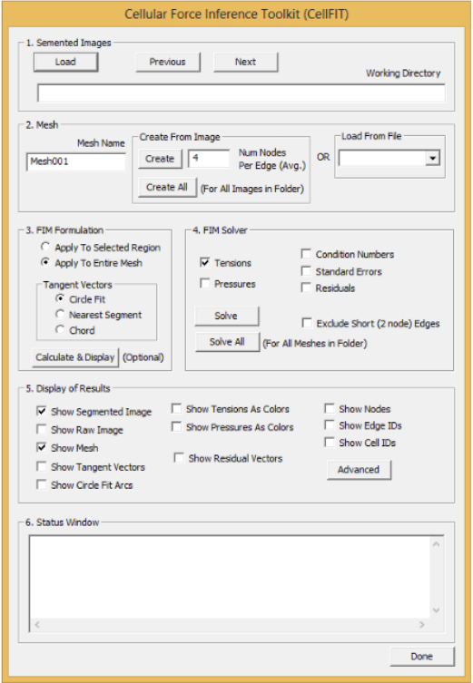

------------------------------------------------------------
dataflow.md: describing the high-level i/o of data for different
steps taken by CellFIT.

Created 08/11/18 by XJ
------------------------------------------------------------

### Quick ideas:
Web app? Easy access from any broswer.
https://developers.google.com/web/
https://aws.amazon.com/serverless/build-a-web-app/
Issues with speed? Handling of stacks of images?

### UI driver
Zazu/Dialogs/IBFIDlg.cpp is the main driver.
(could definitely use some renaming...)

#### 1. Segmented image
OnBnClickedButtonIbfiimload(): loads the file - segmented image in raster form. Can take either watershed image or skeleton image, which will be converted into watershed.
e.g. /ZazuCellFITSoftware/Data/Dragonfly/SegmentedImages/DragonflyWing.tif
OnBnClickedButtonIbfilnext(): see below
OnBnClickedButtonIbfiprev(): pressing the Previous or Next buttons will load the next or previous segmented image in the same folder.
#### 2. Mesh
OnBnClickedButtonIbficreatemesh(): the create button will produce a mesh from which CellFIT calculations will be performed. CIBFIDlg::CreateAndSaveMesh() is called. CreateAndSaveMesh is defined right below and calls on WatershedToModel algo; (WatershedToModel.cpp), which converts watershed to finite element model. The data is dumped into a .txt file e.g. ZazuCellFITSoftware/Data/Dragonfly/Meshes/Mesh001/DragonflyWing.txt and the original data is kept in memory. CreateAndSaveMesh() calls algo.Generate(im, .. pModel ..) defined in (WatershedToModel.cpp) passes pModel which is SimbaData structure. Zazu/Algorithms/CWatershedAlgs.cpp holds a bulk of the functions that converts image into map.
Intermediate nodes are picked with a smooth cubic curve (Cube fit).
Simbadata structure: Map of nodes, edges...

#### 3. FIM Formulation
OnBnClickedButtonIbficalanddisp(): Calculates and tangent vectors and circle fits.
	+ Create pModel copy  
	+ some processing
		CSMeshAlgs::DeleteDanglingCells(subModel)
			Located in Library/SimbaData/Source/Algorithms/MeshAlgs.cpp line 1939
		subModel->SetCell2DEasyLookups();
			Located in Library/SimbaData/Source/SimbaData.cpp line 5332
		MusicalCell2D mus(subModel);
			Makes mus class object
			Located in Library/SimbaData/Source/Elements/MusicalCell2D.cpp
		mus.FindAndFixQuadJunctions();
			Defined in MusicalCell2D.cpp line 1794	
	+ copy results back to original copy
	+ save

#### 4. FIM Solver
OnBnClickedButtonIbfisolve(): solves for tensions and/or pressures.  
	+ IBFISolveMesh();
OnBnClickedButtonIbfisolveall(): solves for all meshes in folder.
 The reaso
#### 5. Display of Results
OnBnClickedCheckIbfishowcircles()
OnBnClickedCheckIbfishowtensions()
OnBnClickedCheckIbfishowpressures()
OnBnClickedCheckIbfishowmesh()
OnBnClickedCheckIfbishowresid()
OnBnClickedCheckIbfishowrawimages()

#### 6. Status Window
Progress bar etc..?

Ouput: Output.csv
		 e.g. ZazuCellFITSoftware/Data/Synthetic/Meshes/Mesh001
		 		/synthetic_Output.csv
Main: CIBFIDlg::OnBnClickedButtonIbficalandisp()

Library/SimbaData/Source/Algorithms/MeshAlgs.cpp does
the bulk of the set up and solving. GTG.Solve(rhs) 
is the actual solving call.
